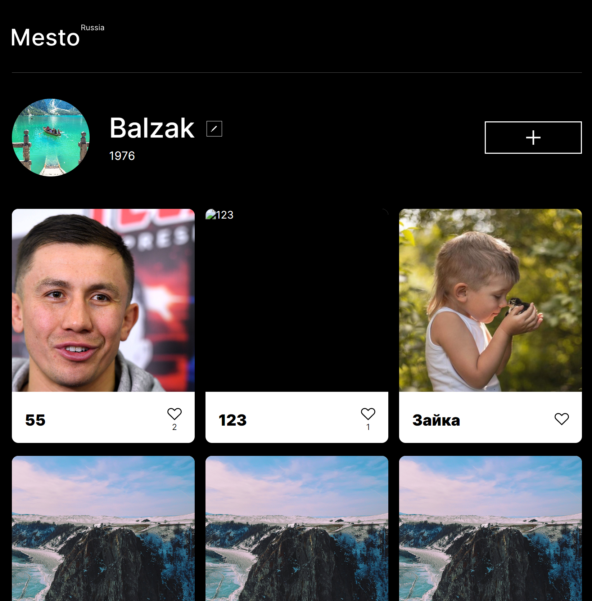
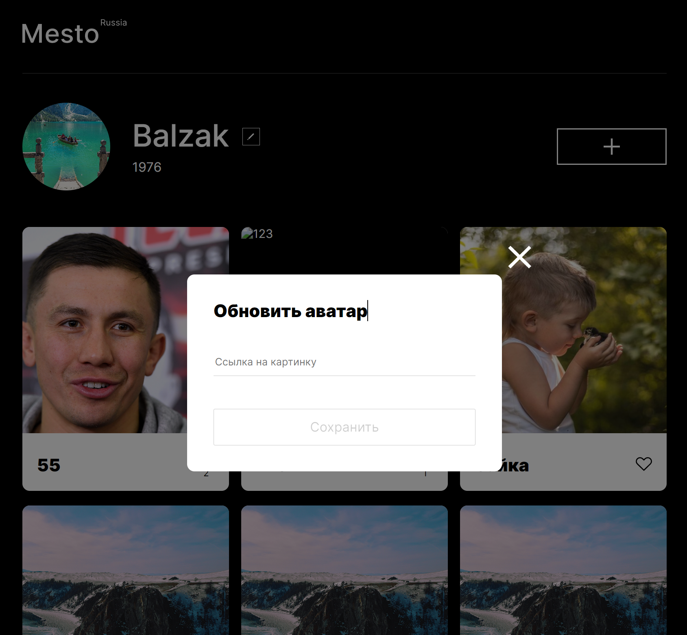

# Проект: MESTO-REACT

#### Ссылка на сайт: https://balzak1976.github.io/mesto-react/

## Описание и функциональность проекта

1.  В проекте используются фреймворк React:

        - созданы основные компоненты Header, Main, Footer
        - настроена работа попапов
        - сделан вывод карточек
        - добавлена возможность ставить лайки, удалять карточку
        - формы редактирования сохраняют данные на сервере
        - настроена валидация

    >

1.  Для управлением открытия и закрытия попапов применяются стейты.
1.  Для инициализации профиля и карточек использован useEffect.
1.  Продолжена работа над портированием проекта на React:
1.  Данные текущего пользователя пробрасываются в разные места приложения с помощью контекста.
1.  Поля формы обрабатываются через управляемые компоненты и хук Ref.

|              Главная страница              |              Обноваление аватара              |              Катрточка              |
| :----------------------------------------: | :-------------------------------------------: | :---------------------------------: |
|  |  |  |

## Стэк технологий


| <a href="https://html.spec.whatwg.org/multipage/" target="_blank" rel="noreferrer"></a> | <a href="https://www.w3schools.com/css/" target="_blank" rel="noreferrer"></a> | <a href="https://react.dev/" target="_blank" rel="noreferrer"></a> |
| :---: | :---: | :---: |
| HTML | CSS  | React |

<br>

## Запуск проекта

клонировать репозиторий 

```javascript
git clone https://github.com/Balzak1976/mesto-react.git
```

установить зависимости

```javascript
npm ci 
```
запуск проекта в режиме разработки ( адрес: `http://localhost:3000` )

```javascript
npm run start 
```
создать финальную сборку ( папка `build` )

```javascript
npm run build 
```